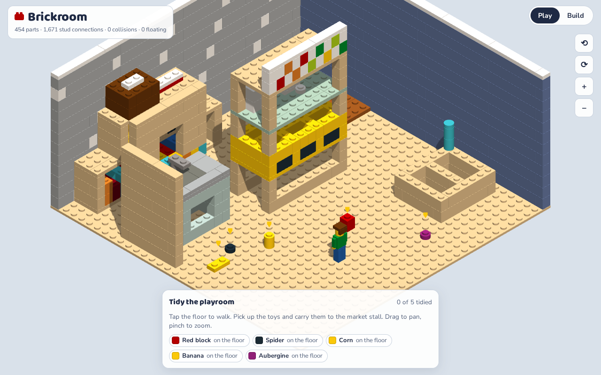

# Brickroom

A photo of a real playroom, turned into a buildable LEGO model, a parts list, step-by-step instructions and an isometric game.

- **Play it:** [Brickroom game](https://claude.ai/artifact/KBWtyw5RSE68i5y54NhbpF) (private artifact; the same file as `dist/brickroom.html`)
- **Research behind it:** [Opus 5.5 Brickworks report](https://claude.ai/artifact/N2GsPPMzKboAYAzSddoe2B) (private artifact; source in `research/opus55-brickworks.html`)



## What it does

1. `scene.mjs` describes the room: walls, bookshelf, play kitchen, market stall, toy shelf and five toys on the floor. It is written as layers of stud cells, based on a photo sent on 2026-09-26. The photo itself is not in the repo.
2. `lib/builder.mjs` packs each layer into real LEGO parts (bricks, plates, tiles; see `lib/catalog.mjs`). It only places a part where it can grip something below, and it prefers parts that bridge the seams of the course underneath.
3. `lib/validate.mjs` checks the result without trusting the packer: collisions, bounds, stud connections, connection to the baseplate, buildability in instruction order, and balance of each object.
4. `build.mjs` writes the outputs, and `bundle.mjs` makes the single-file game.

## Current model

From `out/report.md`:

- 454 parts (453 + the 32 × 32 baseplate), 111 part/colour lots
- 1,671 stud connections, 0 collisions, 0 parts floating
- 76 instruction steps, and every part has something to click onto when it is placed
- 65% of stacked parts bridge two or more parts below
- Every object's centre of mass is over its footprint

## Outputs

| File | What it is |
| --- | --- |
| `out/brickroom.ldr` | LDraw model with `STEP` markers. Opens in LeoCAD, BrickLink Studio or LPub3D (LPub3D makes a PDF booklet). |
| `out/parts.csv` | Parts list with LDraw and BrickLink colour ids |
| `out/bricklink.xml` | BrickLink wanted list. Upload it at bricklink.com/v2/wanted/upload.page. |
| `out/report.md` | Validation report |
| `dist/brickroom.html` | The game and build viewer in one file. It loads three.js r128 from cdnjs. |

BrickLink colour ids in `lib/catalog.mjs` are from memory. Check them before ordering. The model has not been priced.

## Game

- **Play:** tap the floor to walk the minifig around. It picks up toys when it walks over them. Walk next to the market stall and the toys fly into the crate. Tidy all five to win. Arrow keys and WASD also work.
- **Build:** step through the 76 instruction steps. Each step's new parts drop in with a red outline, and the panel lists them with part numbers.
- The view is a true isometric orthographic camera (35.264° pitch). You can rotate it in quarter turns. The wall facing the camera hides itself.

## Build

```sh
node build.mjs    # model + checks + outputs; exits 1 if any check fails
node bundle.mjs   # dist/brickroom.html
```

No dependencies. Needs Node 18+.

## Scale

1 stud ≈ 10 cm, 1 plate ≈ 4 cm. The market stall comes out about 1.5 m tall and the kitchen counter about 50 cm.
